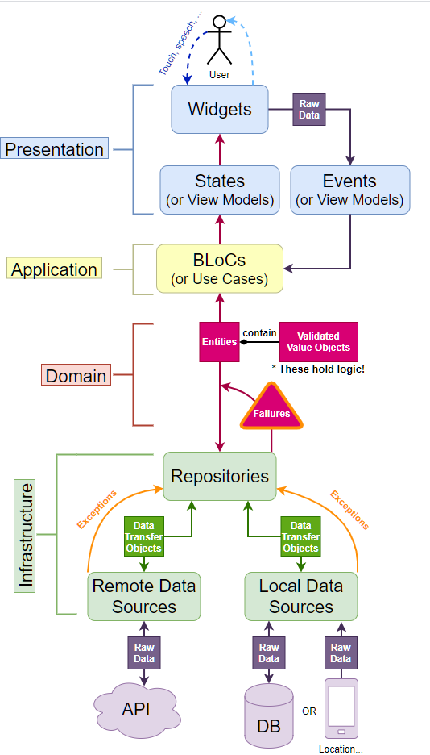

# lyrics_app

Look for your favorite songs and sing it!

## Getting Started

This project is using DDD [(Domain Driven Design)](https://resocoder.com/2020/03/09/flutter-firebase-ddd-course-1-domain-driven-design-principles/) with a personal slight modification in the infrastructure layer.




## How to use

This project is a normal flutter project, so, before running make sure you have the Flutter sdk installed. You can follow this [guide](https://flutter.dev/docs/get-started/install) to get it done.

Then:

1. Clone this repository
2. Upgrade your flutter SDK to the latest version in channel master. Today:


3. Get dependencies with 
```
flutter pub get
```
4. run the project with
```
flutter run
```


For help getting started with Flutter, view our
[online documentation](https://flutter.dev/docs), which offers tutorials,
samples, guidance on mobile development, and a full API reference.
